# JPPack


A collection of VCL/LCL components for Delphi 2009 - 11.0 Alexandria and Lazarus

* [JPPack](#jppack)
  * [Overview](#overview)
    * [Cindy Components](#cindy-components)
    * [PngComponents](#pngcomponents)
  * [AnchoredControls](#anchoredcontrols)
  * [TagExt](#tagext)
  * [Components](#components)
    * [TJppPanel](#tjpppanel)
    * [TJppBasicPanel](#tjppbasicpanel)
    * [TJppSimplePanel](#tjppsimplepanel)
    * [TJppFlipPanel](#tjppflippanel)
    * [TJppStdPanel](#tjppstdpanel)
    * [TJppPngButton](#tjpppngbutton)
    * [TJppBasicPngButton](#tjppbasicpngbutton)
    * [TJppBasicPngButtonEx](#tjppbasicpngbuttonex)
    * [TJppBasicSpeedButton](#tjppbasicspeedbutton)
    * [TJppComboBox](#tjppcombobox)
    * [TJppComboBoxEx](#tjppcomboboxex)
    * [TJppFlatComboBox](#tjppflatcombobox)
    * [TJppColorComboBox](#tjppcolorcombobox)
    * [TJppColorListBox](#tjppcolorlistbox)
    * [TJppColorSwatch, TJppColorSwatchEx](#tjppcolorswatch-tjppcolorswatchex)
    * [TJppProgressBar](#tjppprogressbar)
    * [TJppHtmlHint](#tjpphtmlhint)
    * [TJppLabel](#tjpplabel)
    * [TJppShadowLabel](#tjppshadowlabel)
    * [TJppLinkLabel](#tjpplinklabel)
    * [TJppDoubleLineLabel](#tjppdoublelinelabel)
    * [TJppDoubleLabel](#tjppdoublelabel)
    * [TJppEdit](#tjppedit)
    * [TJppEditEx](#tjppeditex)
    * [TJppMemo](#tjppmemo)
    * [TJppMemoEx](#tjppmemoex)
    * [TJppCheckBox](#tjppcheckbox)
    * [TJppRadioButton](#tjppradiobutton)
    * [TJppDateTimePicker](#tjppdatetimepicker)
    * [TJppGPHatchStyleComboBox](#tjppgphatchstylecombobox)
    * [TJppBrushStyleComboBox](#tjppbrushstylecombobox)
    * [TJppPenStyleComboBox](#tjpppenstylecombobox)
    * [TJppTimer](#tjpptimer)
    * [TJppPngCollection](#tjpppngcollection)
    * [TJppStorageCtrl](#tjppstoragectrl)
    * [TJppStringStorageCtrl](#tjppstringstoragectrl)
  * [Installation](#installation)
    * [Delphi](#delphi)
    * [Lazarus](#lazarus)
    * [CodeTyphon](#codetyphon)
  * [License](#license)

---

## Overview

**JPPack** is a small collection of VCL components for [Delphi](https://www.embarcadero.com/products/delphi/starter/free-download) and LCL components for [Lazarus](https://www.lazarus-ide.org/) and [CodeTyphon](https://pilotlogic.com/).

Supported Delphi versions: **2009**, **2010**, **XE**, **XE2**, **XE3**, **XE4**, **XE5**, **XE6**, **XE7**, **XE8**, **10.0 Seattle**, **10.1 Berlin**, **10.2 Tokyo**, **10.3 Rio**, **10.4 Sydney**, **11.0 Alexandria**.  
**Lazarus**: Required FPC version ~~3.0.4~~ **3.2.0** or newer (tested on Lazarus 2.0.10 + FPC 3.2.0, Lazarus 2.2.0 + FPC 3.2.2 and Lazarus 2.2.2 + FPC 3.2.2).
**CodeTyphon**: Tested on CodeTyphon 7.7 r2202141933 with FPC 3.3.1 r2202141933

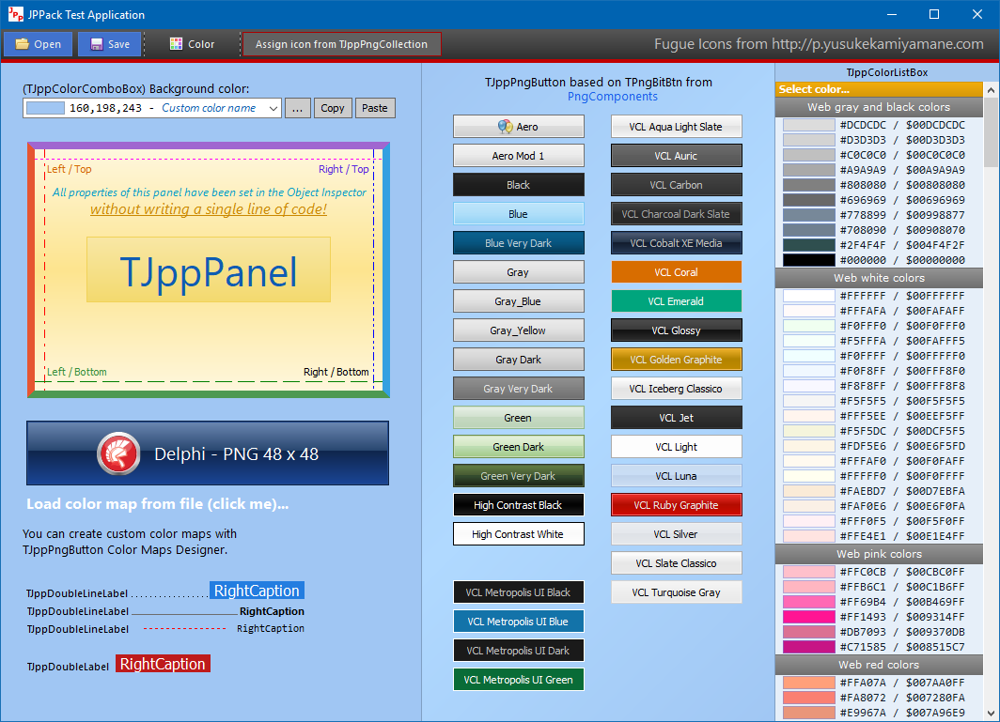

These components were created within a few years, they were repeatedly modified, improved, and extended with the functions needed in the implementation of specific projects. Generally, there is a small chaos, but I think everything works OK (I hope!).

I am no expert on writing VCL components and helped myself by analyzing the source codes (and using fragments) of various free Delphi components, especially [Cindy Components](https://sourceforge.net/projects/tcycomponents/) and [PngComponents](https://github.com/UweRaabe/PngComponents).

### Cindy Components

Some of the functions and procedures related to graphics processing were taken from the *Cindy Components*. The gradient related routines were almost entirely taken from this package (`VCL.cyGraphics.pas` file).

The author of the *Cindy Component*s is Júlio Maurício Antunes Piao. The sources are available at <https://sourceforge.net/projects/tcycomponents/>
In the source files in which I use functions written by Júlio, I have added relevant information with a link to his page.

### PngComponents

After *long and fierce battles* with various buttons from different packages of components for Delphi (commercial and free), I finally found ones that displays the PNG files correctly - **TPngBitBtn** and **TPngSpeedButton** from the *PngComponents* package. I have never had problems with them, unlike many, many others. For this reason, in the implementation of my buttons I decided to rely on the code from this package.

The original author of the *PngComponents* package is Martijn Saly (`www.thany.org`). The project is currently maintained by [Uwe Raabe](http://www.uweraabe.de/Blog/). Sources are available at <https://github.com/UweRaabe/PngComponents>

In the folder [3rd-party](3rd-party) you can find the ZIP file with the *PngComponents* ver. 1.4.1. This is the latest version of the *PngComponents* available when writing this document and it works fine with the *JPPack*.  
**2020.08.31 - Version from GitHub works well too.**

---

## AnchoredControls

Each visual component in the JPPack package supports anchoring of external components using the `AnchoredControls` property.  
You can anchor external components to any edge. When you change the size or position of the main component, the position of the anchored components will be automatically updated.

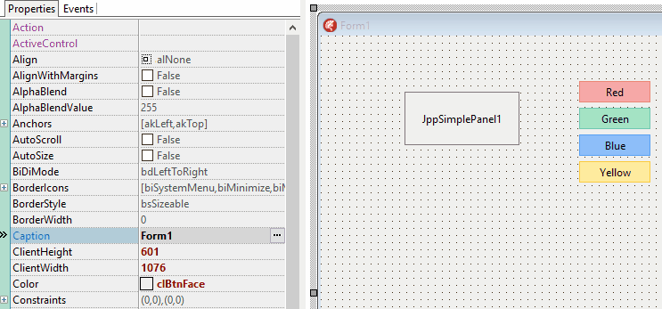

---

## TagExt

Most components in the **JPPack** package has the `TagExt` property. Here you can store one integer value (`IntValue`), string (`StrValue`), float number (`RealValue`), pointer (`PointerValue`) and date (`DateValue`). The first three values are available from the **Object Inspector** and in the code, the last two - only in the code.

Default values:

Property              | Default value
----------------------|--------------
`TagExt.IntValue`     | `0`
`TagExt.StrValue`     | `''` (empty string)
`TagExt.RealValue`    | `0`
`TagExt.PointerValue` | **`nil`**
`TagExt.DateValue`    | `Now`

---

## Components

### TJppPanel

A highly customizable panel. `TCustomPanel` descendant.
It was written on the basis of one of the panels included in the *Cindy Components* package (but I do not remember exactly which one).


The panel is divided into two parts - upper and lower. For each of them you can define colors (gradient or solid) separately.

All panel borders are configured separately. You can set different color, thickness, style, visibility for each border.

The panel has a built-in support for the unlimited collection of captions. Each caption has its own property `Font: TFont`, and can be centered or positioned relative to the corners of the panel.

Moreover, the `TJppPanel` has a built-in support for the unlimited collection of horizontal lines, vertical lines and horizontal bars.

[More info...](./docs/TJppPanel.md)

---

### TJppBasicPanel

A truncated version of the `TJppPanel`. It does not have built-in collections of captions, vertical lines, horizontal lines, and horizontal bars.

---

### TJppSimplePanel

A truncated version of the `TJppBasicPanel`. It has only one gradient, all borders have the same color (`Appearance.BorderColor`), but each border can be hidden/shown (`Appearance`: `DrawTopBorder`, `DrawBottomBorder`, `DrawLeftBorder`, `DrawRightBorder`).

This panel is great for creating a basic UI layout.

---

### TJppFlipPanel

Highly customizable collapsible panel based on the `TJvRollOut` panel from the JVCL package
<https://github.com/project-jedi/jvcl/blob/master/jvcl/run/JvRollOut.pas>

Original license: MPL 1.1  
My modifications: public domain

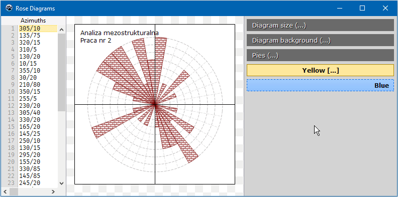

You can put top-aligned panels on the `ScrollBox` to simulate `CategoryPanelGroup` from Delphi.

---

### TJppStdPanel

`TCustomPanel` descendant

Standard panel with component anchoring support.

---

### TJppPngButton

Currently **only for Delphi**.  
`TJppPngButton` is an extended `TPngBitBtn` button from the **PngComponents** package.


The button can be in one of **five states**: *normal*, *hot*, *down* (pressed), *focused* and *disabled*. For each state you can set a whole range of display parameters: upper and bottom gradient/solid color (similarly to `TJppPanel`), border color, style and width, font parameters (color, name, size, style).

If you want the button to be displayed in system colors, set property `Appearance.DefaultDrawing` to `True` (all custom colors defined in the `Appearance.<STATES>` will then be ignored).

The number of all colors for all button states is really big, so I decided to make it easier to manage the displayed colors using ready-to-use color schemes (color maps).

I have created 36 different color schemes for `TJppPngButton`. To change the active color scheme, select one of the schemes available in the `ColorMapType` property in the *Object Inspector*.

Color schemes can be edited with the `TJppPngButton Color Maps Designer` program, which is located in the repository in the `demos` directory.

[More info...](./docs/TJppPngButton.md)

---

### TJppBasicPngButton

Currently **only for Delphi**.  
This button is a slightly truncated version of the `TJppPngButton`. It has only one gradient for each button state and does not support color schemes.

---

### TJppBasicPngButtonEx

Currently **only for Delphi**.  
Similar to `TJppBasicPngButton` but with support for subcaption.

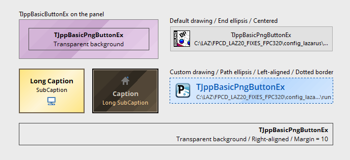

---

### TJppBasicSpeedButton

This button is very similar to `TJppBasicPngButton`, but it is based on `TGraphicControl`, so it does not take the focus (it has no *focused* state).

---

### TJppComboBox

`TCustomComboBox` descendant.

Additional properties:

* `AnchoredControls`
* `BoundLabel` - Internal label.
* `Flash` - Flashing options. To turn on flashing, call the `FlashBackground` method in the code.
* `ShowLabel` - Show / hide bound label.
* `TagExt`

---

### TJppComboBoxEx

`TCustomComboBoxEx` descendant.

Fixed item height bug in older Delphi versions.

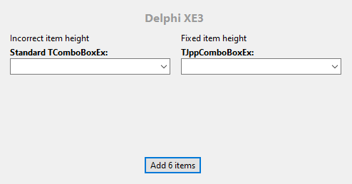

Additional properties:

* `AnchoredControls`
* `BoundLabel` - Internal label.
* `Flash` - Flashing options. To turn on flashing, call the `FlashBackground` method in the code.
* `ShowLabel` - Show / hide bound label.
* `TagExt`
* published `ItemIndex`

---

### TJppFlatComboBox

Currently **only for Delphi**.

Highly customizable ComboBox based on the `TFlatComboBox`  
<https://github.com/jackdp/FlatStyle/blob/master/Source/TFlatComboBoxUnit.pas>

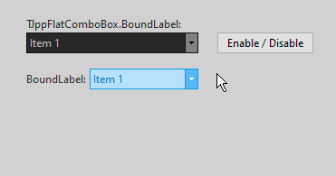

---

### TJppColorComboBox

A highly customizable *ComboBox* displaying a list of predefined and/or user-defined colors.

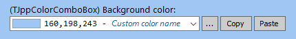


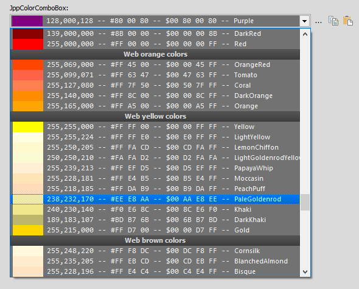

The `TJppColorComboBox` has 4 built-in components: one label and 3 buttons to change, copy and paste color.

Colors can be displayed in three formats: **RGB Int** (eg. 051,102,255), **RGB Hex** (eg. #3366FF), and **BGR Hex** (eg. $00FF6633). If you need to display the color in a different format, you can do this in the `OnGetColorStrValue` event handler.

In addition to standard items (displaying color) you can also add separators and *ChangeColor* items.

Each color selected by the user, but not yet in the color list, can be automatically added to the end or top of the list. Thanks to this the user of your application has access to the *history* of previously selected colors.

[More info...](./docs/TJppColorComboBox.md)

---

### TJppColorListBox

A highly customizable *ListBox* displaying a list of predefined and/or user-defined colors.

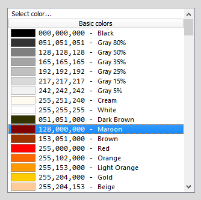

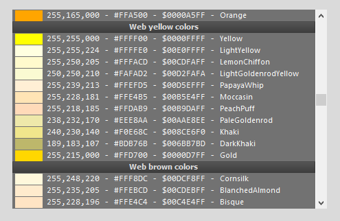

It is very similar to `TJppColorComboBox`, but it has no built-in components.

---

### TJppColorSwatch, TJppColorSwatchEx

**TJppColorSwatch** is a component displaying the color and its value (code) in two formats.

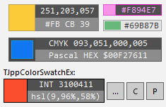

It consists of three parts: a rectangle displaying the color (on the left) and two rectangles with the codes of the selected color. Each part can be hidden, so you can, for example, display only a rectangle with a color or only the color code in the selected format.

Available color formats:

| Format         | Example           |
|----------------|-------------------|
| `ctBgr`        | `128,064,032`     |
| `ctCmyk`       | `075,050,000,050` |
| `ctCppHex`     | `0x00804020`      |
| `ctHslCss`     | `220,60%,31%`     |
| `ctHslWin`     | `146,144,075`     |
| `ctHtml`       | `#204080`         |
| `ctPascalHex`  | `$00804020`       |
| `ctPascalInt`  | `8405024`         |
| `ctRgb`        | `032,064,128`     |
| `ctRgbPercent` | `13%,25%,50%`     |

If you want to display the color code in some other format, you can do it in the `OnGetTopColorStrValue` event handler (for the upper color code) and `OnGetBottomColorStrValue` (for the bottom).

**TJppColorSwatchEx** is an extended version of the **TJppColorSwatch**. It has a built-in label (`BoundLabel`) and three buttons: `ButtonChangeColor`, `ButtonCopyColor` and `ButtonPasteColor`.

`BoundLabel` is a standard label (`TCustomLabel` descendant) and can be displayed on the left, right, above or below the component. The buttons are inherited from the `TJppBasicSpeedButton` class, so you can freely set the colors for all button states (normal, hot, down, disabled) and the PNG icon.

---

### TJppProgressBar

A highly customizable progress bar based on **JvSpecialProgress** from JVCL package, but with many of my modifications.
<https://github.com/project-jedi/jvcl/blob/master/jvcl/run/JvSpecialProgress.pas>

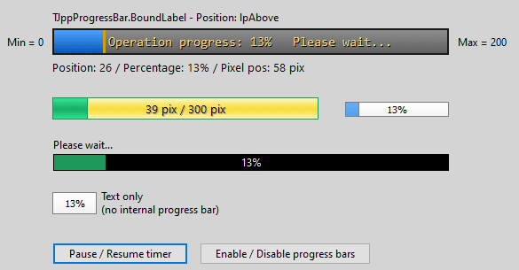

My modifications:

* **Appearance**  
Here you can modify many parameters related to the appearance of the control: background and progress bar color (solid or gradient), border color and size, fonts (for normal and disabled state), text alignment (top-left, top-center, top-right, left, center...), prefix and postfix, text shadow and more. Unlike the standard progress bar, TJppProgressBar also allows you to set the colors displayed when the component is disabled.  
EndMarker - A rectangle drawn at the end of the progress bar.  
TextDisplayMode - position, percentage, position in pixels, caption or none.  
Stages: Middle and Final - You can make color corrections here.  
ProgressBarVisible - Here you can block the progress bar from showing and only display the text.

* AnchoredControls  
You can pin one external control (e.g. TButton, TEdit) to each edge of a component.

* BoundLabel - Internal label

* UpdatePositionIfDisabled - Here you can decide whether to update the progress bar when the component is disabled.

* OnProgressChanged  
Triggered when the current position changes. You can perform some additional actions here.

* TagExt
  
---

### TJppHtmlHint

Currently **only for Delphi**.  
A lightweight HTML hint component for Delphi (in Lazarus it compiles but doesn't work).

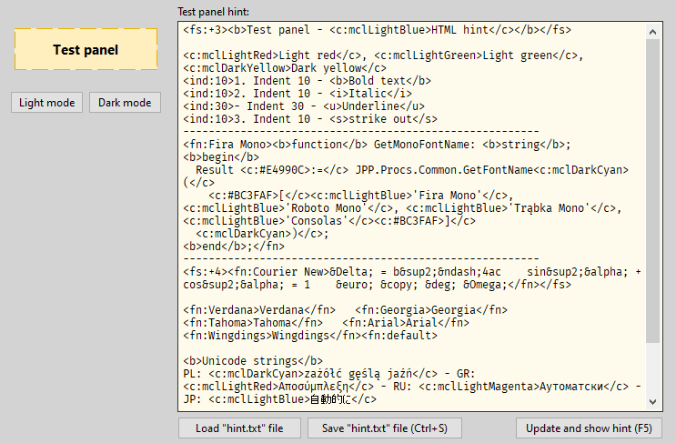

This component was created by combining two Pascal units:

1. **TFlatHintUnit.pas** from the FlatStyle package  
   <https://github.com/jackdp/FlatStyle/blob/master/Source/TFlatHintUnit.pas>  
   License: Free (no additional information)

2. **HtHint.pas** from the JVCL package
  <https://github.com/project-jedi/jvcl/blob/master/jvcl/install/JVCLInstall/Helpers/HtHint.pas>  
  License: MPL 1.1

License for my modifications: no license (public domain)

TJppHtmlHint is not a full-featured HTML component. This is a lightweight and **very simple** component with support for just a few HTML tags, in addition, with a slightly unusual syntax.

Supported tags:

**B** - `<b>bold text</b>`  
**I** - `<i>italic</i>`  
**U** - `<u>underline</u>`  
**S** - `<s>strike out</s>`

**C**:color - text color, eg: `<c:clRed>text</cl>`, `<cl:Red>text</c>`, `<c:#FF0000>text</c>`, `<c:255,0,0>RGB color</c>`  
**BG**:color - background color, eg. `<bg:clYellow>yellow background</bg>`

**IND**:x - indentation from current position. `eg. <ind:10>`  
**AIND**:x - absolute indentation, eg. `<aind:20>`

**FS**:x - font size, eg. `<fs:12>some text</fs>`, `<fs:+4>text</fs>`  
**FN**:name - font name, eg. `<fn:Verdana>text</fn>`, `<fn:Courier New>text</fn>`, `<fn:default>restore default font</fn>`

Metacolors (or mode-colors): Colors taken from the `Appearance.DarkModeColors` or `Appearance.LightModeColors` palette  
Example: `<c:mclDarkBlue><bg:mclLightGray>dark blue text on light gray background</bg></c>`

HTML entities: see function `ReplaceHtmlEntities` in the `JPP.HtmlHint.pas` file.

---

### TJppLabel

`TCustomLabel` descendant.  
Additional properties: AnchoredControls, TagExt.

---

### TJppShadowLabel

Based on `TJppLabel`.  
Additional properties: shadow for enabled and disabled state, disabled caption color, border (color, size, style), padding.

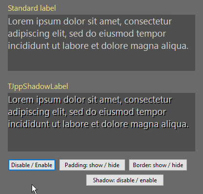

---

### TJppLinkLabel

`TCustomLabel` descendant.  
Label with additional fonts (`TFont`) for 5 states: *normal*, *visited-normal*, *hot*, *visited-hot* and *disabled*.  
After clicking, it can open the URL in the default browser, execute file with `ShellExecute` or perform an action from **TActionList**.

[More info...](./docs/TJppLinkLabel.md)

---

### TJppDoubleLineLabel

A label component composed of 3 parts:

1. Left caption (property `Caption`)
2. Right caption (property `RightCaption`)
3. Line drawn between the captions.

Based on **TPegtopLineLabel** from **Pegtop Common Components** written by Jens Gruschel (<http://www.pegtop.net/delphi/components/common/index.htm>).

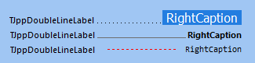

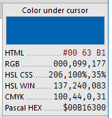

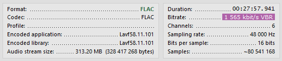

My modifications:

* **TPegtopLineLabel** renamed to **TJppDoubleLineLabel**
* `Annex` renamed to `RightCaption`
* AnchoredControls
* AutoHeight
* DisabledLineColor
* LinePosDeltaY
* LineSizeDeltaX1
* LineSizeDeltaX2
* RightCaptionFont
* RightCaptionColor
* RightCaptionDisabledColor
* RightCaptionBorderColor
* RightCaptionDisabledBorderColor
* RightCaptionDisabledTextColor
* RightCaptionPosDeltaY
* TagExt
* Added prefixes `Jpp`

The `RightCaption` has its own font, background and border color.
The `RightCaption` can be positioned vertically by `RightCaptionPosDeltaY`.
The line can be positioned vertically by `LinePosDeltaY`.
The length of the line can be modified by `LineSizeDeltaX1` and `LineSizeDeltaX2`.
If `AutoHeight = True`, the height of the component will be calculated and applied automatically.

---

### TJppDoubleLabel

A simple label component composed of 2 captions: left (property `Caption`) and right (property `RightCaption`).

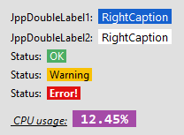

The space between captions can be modified using the `Spacing` property.
Based on **TJppDoubleLineLabel**.

---

### TJppEdit

An edit component derived from `TCustomEdit`.

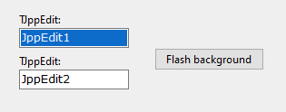

Additional properties:

* `AnchoredControls`
* `Appearance` - Here you can set the background and font color for four states: Normal, Hot, Focused, Disabled.
* `BoundLabel` - Internal label
* `Flash` - `FlashColor`, `FlashCount`, `FlashInterval`. To turn on flashing, call the `FlashBackground` method. This function can be used to indicate the user of an incorrect value.
* `ShowLabel` - Show / hide bound label.
* `TagExt` - Extended tag.

---

### TJppEditEx

Currently **only for Delphi**.  
Similar to `TJppEdit`, but also has the ability to define border colors.  
Border drawing methods based on `TFlatEdit` from the **FlatStyle** package <https://sourceforge.net/projects/flatstyle/>

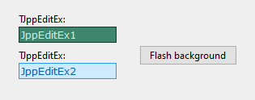

---

### TJppMemo

`TCustomMemo` descendant.

Additional properties:

* `AnchoredControls`
* `Appearance` - Here you can set the background and font color for four states: Normal, Hot, Focused, Disabled.
* `BoundLabel` - Internal label
* `Flash` - `FlashColor`, `FlashCount`, `FlashInterval`. To turn on flashing, call the `FlashBackground` method. This function can be used to indicate the user of an incorrect value.
* `ShowLabel` - Show / hide bound label.
* `Text` - Easy access to `Lines.Text`
* `TagExt` - Extended tag.

---

### TJppMemoEx

Similar to `TJppMemo`, but also has the ability to define border colors.  
Border drawing methods based on `TFlatMemo` from the **FlatStyle** package <https://sourceforge.net/projects/flatstyle/>

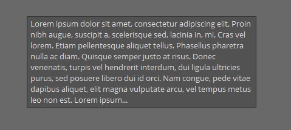

---

### TJppCheckBox

A standard `TCheckBox` with the `TagExt` and `AnchoredControls` support.

---

### TJppRadioButton

A standard `TRadioButton` with the `TagExt` and `AnchoredControls` support.

---

### TJppDateTimePicker

A standard `TDateTimePicker` with the `BoundLabel`, `TagExt` and `AnchoredControls` support.

---

### TJppGPHatchStyleComboBox

**Windows only**  
Lazarus and Delphi X2 or newer.

Highly customizable GDI+ hatch style selector with `BoundLabel` and `AnchoredControls`.

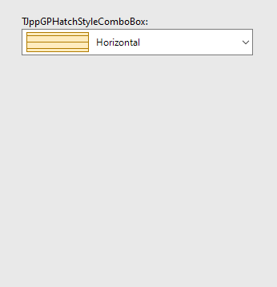

---

### TJppBrushStyleComboBox

A highly customizable combo box with a list of brush styles.

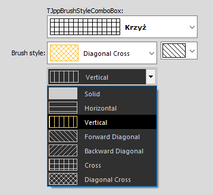

Current style can be read/set using the `Selected` property.

The brush style display name can be changed in the `OnGetDisplayName` event handler.

The *TJppBrushStyleComboBox* has a built-in label (`BoundLabel`).

---

### TJppPenStyleComboBox

A highly customizable combo box with a list of pen styles.

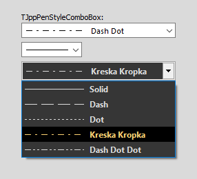

Current style can be read/set using the `Selected` property.

The pen style display name can be changed in the `OnGetDisplayName` event handler.

The *TJppPenStyleComboBox* has a built-in label (`BoundLabel`).

---

### TJppTimer

A standard `TTimer` component with a few additional properties and methods:

1. `RepeatCountLimit` property.
Here you can set how many times the time interval specified in the `Interval` property can be reached. The value `0` means no limit.
1. `Counter` property.
Each time the time interval specified in the `Interval` property expires, the `Counter` property is incremented by 1. When the `Counter` reaches the value of `RepeatCountLimit`, the timer is stopped and the `OnRepeatCountLimitReached` event handler is triggered (if assigned).
1. `ClearCounterOnStart` property. If is set to `True`, then the `Start` method resets the `Counter`.
1. `Start` method. Sets `Enabled` to `True`. If `ClearCounterOnStart` is set to `True` then the `Start` sets the `Counter` property to `0`.
1. `Stop` method. Sets the `Enabled` to `False`.
1. `OnRepeatCountLimitReached` event - fired when the `Counter` reaches the value of `RepeatCountLimit`.

Example: Displaying the counter every one second. Display the message after 10 seconds and switch off of the `Timer`.

```pascal
procedure TForm1.FormCreate(Sender: TObject);
begin
  JppTimer1.Interval := 1000;
  JppTimer1.RepeatCountLimit := 10; //JppTimer1 will stop automatically after 10 seconds.
  JppTimer1.Start;
end;

procedure TForm1.JppTimer1Timer(Sender: TObject);
begin
  Label1.Caption := JppTimer1.Counter.ToString;
end;

procedure TForm1.JppTimer1RepeatCountLimitReached(Sender: TObject);
begin
  ShowMessage('10 seconds elapsed!');
end;
```

---

### TJppPngCollection

A non-visual component that can store any number of PNG images. Can be associated with an external **TImage** component.  
Unlike **TImageList**, each image can have a different size. Images are stored internally as PNG, not bitmaps, which reduces the size of the DFM file. Of course, assuming that PNG images are compressed.

PNG images can be added in the **Object Inspector** or in the code using `AddPngImage`, `AddImageFromFile` or `Items.Insert` methods:

```pascal
...
var
  Png: TPngImage;
begin
  Png := TPngImage.Create;
  try
    Png.LoadFromFile('C:\image.png');
    JppPngCollection.AddPngImage(Png);
    // OR
    // JppPngCollection.AddPngImageFromFile('C:\image.png');
  finally
    Png.Free;
  end;
end;
```

The `AddPngImage` method adds a **copy** of the PNG image, so you are responsible for freeing the `Png` object in the above example.

To retrieve a PNG image from a collection, you can use the methods: `GetPngImage`, `GetPngImageByName` or `Items[Index].PngImage`.

There are additional properties associated with each PNG image in the collection:

```delphi
  Name: string;
  Description: string;
  Tag: integer;
  Enabled: Boolean
```

And read only properties:

```delphi
  Width: integer;
  Height: integer;
```

**Important!**
The **TPngImage** objects are created automatically when creating collection items. If you want to check if any item of the collection has a PNG image assigned, you can not do it by comparing with **nil**. You must use the `TPngImage.Empty` method:

```delphi
  // Improperly
  if JppPngCollection.Items[0].PngImage <> nil then ... // <-- Always returns True
```

```delphi
  // Properly
  if not JppPngCollection.Items[0].PngImage.Empty then ... // OK, image assigned
```

---

### TJppStorageCtrl

`TJppStorageCtrl` is a non-visual component that allows you to store information of different types in the collection. Each item of the collection stores the following data:

* 4 String values,
* 2 Integer values,
* 2 Int64 values,
* 2 float values (Double),
* 2 Boolean values,
* 2 TColor values,
* 2 Byte values,
* 2 Pointer values.

Items are accesible from the **Object Inspector** using `StorageCollection` property.
The values of each item of the collection, except pointers, can also be set in the *Object Inspector*. Pointer values can only be set in the code and they are initialized by default to `nil`.

To acces the collection items in the code you can use the `Items` property, eg:

```delphi
JppStorageCtrl.Items[0].IntValue1 := 1;
JppStorageCtrl.Items[0].PointerValue1 := SomePointer;
```

But, since `Items` is set as the **default** property, you can write it simply:

```delphi
JppStorageCtrl[0].IntValue1 := 1;
JppStorageCtrl[0].PointerValue1 := SomePointer;
```

This component can be useful if you want to have access to some global data, and you do not want to create global variables.

I sometimes use this component in the early stages of writing applications. In later stages, a definitely better way to store and manage data is to design specialized records, classes, arrays, generic/pointer containers, etc.

---

### TJppStringStorageCtrl

A non-visual component that allows you to store collection of strings with additional data. Each item of the collection has the following properties:

```delphi
  ItemName: string;
  Value: string;
  Enabled: Boolean;
  Tag: integer;
```

---

## Installation

### Delphi

Before installing the **JPPack** package, you must first install the following packages:

1. **JPLib** from <https://github.com/jackdp/JPLib>
1. **PngComponents** from <https://github.com/UweRaabe/PngComponents>  
You can use *PngComponents* ver. 1.4.1 package from the [3rd-party](3rd-party) folder. I tested *JPPack* with this version and it looks like everything works OK.  
2020.08.31 - Version from GitHub works well too.
1. For Delphi XE2 - Sydney: **IGDIPlusMod** from <https://github.com/jackdp/IGDIPlusMod>

If you have installed the **PNG Components** using the **GetIt Package Manager**, you will probably have to change the name `PngComponents` to `PngComponentsD` in the **JPPack.dpk** file.

In the [packages](packages) folder you can find installation packages for all Delphi versions from **Delphi 2009** to **10.4 Sydney**.
Go to the subfolder with the name of your Delphi version (eg `Delphi_XE7` for XE7 version) and open the file `JPPack.dproj` or `JPPack.dpk`. In the *Project Manager*, right-click the `JPPack.bpl` file, then select `Install` in the popup menu. After a short time, a message should appear displaying information about the correct installation of the package and with the list of newly installed components. All components you can find ont the **JPPack** page in the *Tool Palette*.

You can also compile package for **Win64** target.

After installing the package, it is best to add the `source` folder to the **library path**:

1. Select menu `Tools` --> `Options`.
1. In the tree view on the left, go to `Environment Options` --> `Delphi Options` --> `Library`.
1. In the **Library path** combo box (on the right), add `;` (semicolon) and the path to the `source` directory.

### Lazarus

First, install the **JPLib** package from <https://github.com/jackdp/JPLib>  
On Windows, also install the **IGDIPlusMod** from <https://github.com/jackdp/IGDIPlusMod>

Open package file (`packages\Lazarus\jppacklcl.lpk`) in the Lazarus IDE. Click button `Compile` then `Use`->`Install` and rebuild IDE.
All components you can find ont the **JPPackLCL** page in the *Component Palette*.

### CodeTyphon

Install the **JPLib** package from <https://github.com/jackdp/JPLib>  
On Windows, also install the **IGDIPlusMod** from <https://github.com/jackdp/IGDIPlusMod>

Open package file (`packages\CodeTyphon\jppacklcl.ctpkg`) in the Typhon IDE. Click button `Compile package` (2-nd button on the toolbar) then click the 3-rd button, select `Install` and rebuild IDE.
All components you can find ont the **JPPackLCL** page in the *Component Palette*.

---

## License

The license for my work: **Public domain. You can do with my code whatever you want without any limitations.**

But, in some units I use code from other open source projects, so you should look at the PAS source files and license of the authors of these projects for more information.
