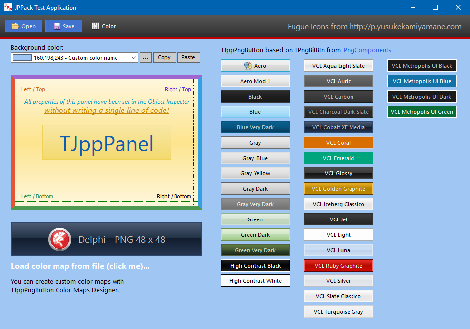
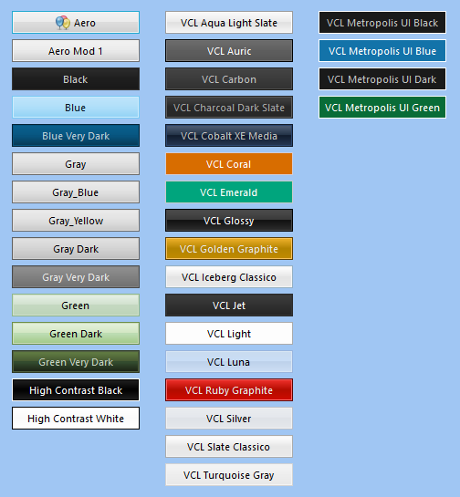
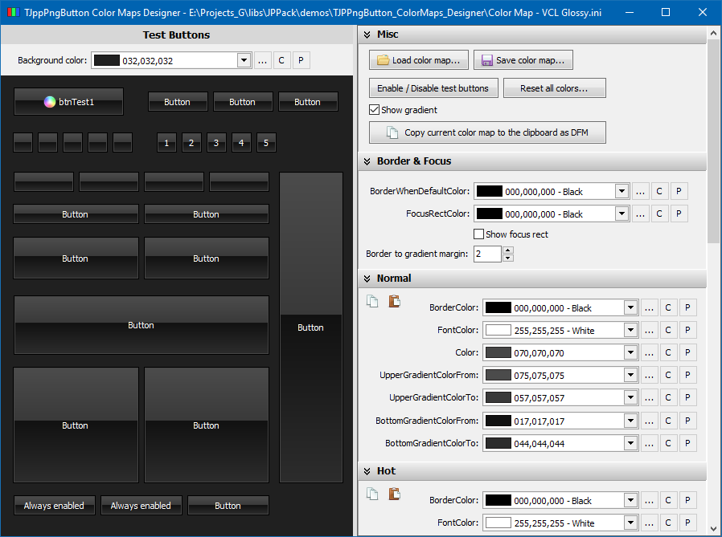
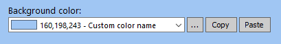
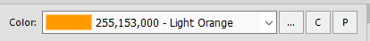

# JPPack - A small collection of VCL components for Delphi

<p align="center">

</p>

## Overview

**JPPack** is a small collection of VCL components for Delphi.

These components were created within a few years, they were repeatedly modified, improved, and expanded with the functions needed in the implementation of specific projects. Generally, there is a small chaos, but I think everything works OK (I hope!).

I am no expert on writing VCL components and helped myself by analyzing the source codes (and using fragments) of various free Delphi components, especially [Cindy Components](https://sourceforge.net/projects/tcycomponents/) and [PngComponents](https://bitbucket.org/uweraabe/pngcomponents).

### Cindy Components

Some of the functions and procedures related to graphics processing were taken from the *Cindy Components*. The gradient related routines were almost entirely taken from this package (`VCL.cyGraphics.pas` file).

The author of the *Cindy Component*s is Júlio Maurício Antunes Piao. The sources are available at https://sourceforge.net/projects/tcycomponents/  
In the source files in which I use functions written by Júlio, I have added relevant information with a link to his page.

### PngComponents

After *long and fierce battles* with various buttons from different packages of components for Delphi (commercial and free), I finally found ones that displays the PNG files correctly - **TPngBitBtn** and **TPngSpeedButton** from the *PngComponents* package. I have never had problems with them, unlike many, many others. For this reason, in the implementation of my buttons I decided to rely on the code from this package.

In my buttons, I use 3 files from the *PngComponent* package: **PngFunctions.pas**, **PngButtonFunctions.pas** and **PngImageList.pas**.

In order to not force potential users to install the full *PngComponents* package (although I recommend doing it), I decided to include these three files in the *JPPack*. To prevent any name conflicts, I added the prefix `PNGC.` to the name of each file (and unit).

The original author of the *PngComponents* package is Martijn Saly (`www.thany.org`). The project is currently maintained by [Uwe Raabe](http://www.uweraabe.de/Blog/). Sources are available at https://bitbucket.org/uweraabe/pngcomponents

In the folder [PngComponents_Docs_License](PngComponents_Docs_License) you can find *PngComponents* package license, changelog and documentation.

## Components

### TJppPanel

A highly customizable panel (`TCustomPanel` descendant) with several additions. It was written on the basis of one of the panels included in the *Cindy Components* package (but I do not remember exactly which one).  

<p align="center">

</p>

Additional properties: 
1. **Upper and bottom part** filled with a gradient (or solid color).  
The panel is divided into two parts - upper and lower. For each of them you can define colors separately. The size of the upper part (relative to the lower) can also be modified (property `Appearance.UpperGradientPercent`). For example, you can set the upper gradient size to 30%, then the bottom will automatically take up the rest of the panel surface (70%). You can also completely eliminate the bottom gradient by setting the `UpperGradientPercent` property to 100%.  
If you need to fill the upper part with a gradient and the bottom one with a solid color, set the desired gradient colors of the upper part, then set the same starting and ending color of the gradient in the lower part.  
If you do not want to use a gradient at all, you can easily turn it off by setting the `Appearance.DrawGradient` property to `False`, then the `Appearance.BackgroundColor` color will be used to fill the panel background with a solid color.

1. **Borders**.  
You can set the thickness, color, style and visibility of the panel borders. Each border is configured separately. For example, you can set the upper border with a pen width = 10 in red, the lower border in green and a pen width = 2, and hide the left and right borders completely. If you do not want to display borders at all, set `Appearance.DrawBorder` to `False`. You have a full control.  

1. Unlimited collections of **horizontal lines**, **vertical lines**, **captions** and **horizontal bars**.  
Each line (vertical and horizontal) is also configured separately and can be set here all standard parameters for the lines - the color, weight, style. The lines can be positioned relative to the edges of the panel or centered.  
The standard panel has only one **caption**, which is always centered and can not be changed. `TJppPanel` can contain any number of captions. They can be centered or positioned relative to the corners of the panel. Moreover, each caption has its own font (`TFont`) and you can freely set font styles, size and color for each caption separately.  
The **horizontal bars** are simply rectangles, the size and position of which you can freely set. In addition, you can set the color, thickness and style of the rectangle's borders. Finally, each rectangle can be filled with a solid color or gradient.

### TJppPngButton

`TJppPngButton` is a much extended `TPngBitBtn` button from the **PngComponents** package.  

<p align="center">

</p>

The button can be in one of **five states**: *normal*, *hot*, *down* (pressed), *focused* and *disabled*. For each state you can set a whole range of display parameters: upper and bottom gradient/solid color (similarly to `TJppPanel`), border color, style and width, font parameters (color, name, size, style). You can also turn off drawing border and/or background (`Appearance.<STATE>.TransparentFrame` / `Appearance.<STATE>.TransparentBackground`).

The visibility of the button **caption** can be quickly changed using the `Appearance.ShowCaption` property.  
If you do not want to display the **focus rectangle** on the active button, set property `Appearance.FocusRect` to `frtNone`.  
If you want the button to be displayed in system colors, set property `Appearance.DefaultDrawing` to `True` (all custom colors defined in the `Appearance.<STATES>` will then be ignored).

#### TJppPngButton - Color maps (Color schemes)

The number of all colors for all button states is really big, so I decided to make it easier to manage the displayed colors using ready-to-use color schemes (color maps).

I have created 36 different color schemes for `TJppPngButton`. To change the active color scheme, select one of the schemes available in the `ColorMapType` property in the *Object Inspector*. Of course, you can also change the color scheme in the code at runtime.

Over half of the color schemes I have prepared are schemes that mimic the **VCL styles** available from the **XE2** version of the Delphi environment. All such schemes begin with the prefix `cmtVcl`. Of course, these *VCL color schemes* work even if you do not enable VCL styles support in your program at all. You can also, for example, turn on the `Charcoal Dark Slate` VCL style for the application, and `cmtVclCarbon` for the `TJppPngButtons`. There is absolutely no problem.

#### TJppPngButton Color Maps Designer
All color schemes I have prepared in the `TJppPngButton Color Maps Designer` program, which is located in the repository in the `demos` directory.

<p align="center">

</p>

This program allows you to quickly create new and modify existing color schemes for TJppPngButton. All color changes are visible immediately (on the left side). You can also freely change the background color of the panel with the test buttons in the *Background color* combo box.

You can save the color scheme to an INI file and then load it in your program using `LoadColorMapFromIniFile` method, eg:

```delphi
// You must add JPP.PngButton.ColorMaps unit to uses section.
JppPngButton.LoadColorMapFromIniFile(
  'MyColorScheme.ini', 'JppPngButton_ColorMap', 
  TJppPngButtonIniColorFormat.icfDefault
);
```

In the folder with the `TJppPngButton Color Maps Designer` program you will find all my color schemes stored in INI files, as well as files with the `*.colors` extension. These are color palettes that you can view and edit in my (not yet completed but fully functioning) [Colors](http://www.pazera-software.com/products/colors/) program.

`TJppPngButton Color Maps Designer` can also be treated as a demonstration program of one of my other components: `TJppColorComboBox`.

### TJppBasicSpeedButton

This button is very similar to `TJppPngButton`, but it is based on `TGraphicControl`, so it does not take the focus (it has no *focused* state). Color schemes support is not implemented yet.

### TJppColorComboBox

ComboBox displaying a list of user-defined colors.

<p align="center">

<br><br>

<br><br>

</p>

The current color can be read and set using property `Selected`: `TColor`.

To add a color to the list, add any number of entries to `Items` in the form:
```
color_name=R,G,B
```
where `R`, `G` and `B` denote the intensity of red, green and blue colors. E.g:
```
Aquamarine=51,204,204
Purple=128,0,128
Pink=255,0,255
Plum=153,51,102
```
The `TJppColorComboBox` has a built-in label, `BoundLabel` property,  so there is no need to add a separate label describing the component's function, which is common practice.

In addition, the component has three built-in auxiliary buttons:
1. `ButtonChangeColor` - After clicking it, the system color selection window (TColorDialog) is displayed. If the user selects a color and presses OK, it will be stored in the `Selected` property.
1. `ButtonCopyColor` - After the user clicks, the currently selected color is copied to the system clipboard.
1. `ButtonPasteColor` - After clicking, the current color is set to the one from the clipboard (if it is correct).

All of these buttons are inherited from the `TJppBasicSpeedButton` class, so you can freely set background colors, borders, fonts, for all available button states: *normal*, *hot*, *down* and *disabled*.

The `ButtonSpacing` property specifies the space between these buttons.

## Installation


