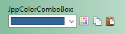
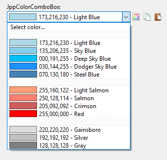

# JPPack

**A small collection of VCL components for Delphi XE2 - 10.2 Tokyo**

- [Overview](#overview)
- [Components](#components)
  * [TJppPanel](#tjpppanel)
  * [TJppPngButton](#tjpppngbutton)
  * [TJppBasicSpeedButton](#tjppbasicspeedbutton)
  * [TJppColorComboBox](#tjppcolorcombobox)
  * [TJppLinkLabel](#tjpplinklabel)
  * [TJppStorageCtrl](#tjppstoragectrl)
- [Installation](#installation)


## Overview

**JPPack** is a small collection of VCL components for Delphi.  
Supported Delphi versions: **XE2**, **XE3**, **XE4**, **XE5**, **XE6**, **XE7**, **XE8**, **10.0 Seattle**, **10.1 Berlin**, **10.2 Tokyo**.

<p align="center">

</p>

These components were created within a few years, they were repeatedly modified, improved, and expanded with the functions needed in the implementation of specific projects. Generally, there is a small chaos, but I think everything works OK (I hope!).

I am no expert on writing VCL components and helped myself by analyzing the source codes (and using fragments) of various free Delphi components, especially [Cindy Components](https://sourceforge.net/projects/tcycomponents/) and [PngComponents](https://bitbucket.org/uweraabe/pngcomponents).

### Cindy Components

Some of the functions and procedures related to graphics processing were taken from the *Cindy Components*. The gradient related routines were almost entirely taken from this package (`VCL.cyGraphics.pas` file).

The author of the *Cindy Component*s is Júlio Maurício Antunes Piao. The sources are available at https://sourceforge.net/projects/tcycomponents/  
In the source files in which I use functions written by Júlio, I have added relevant information with a link to his page.

### PngComponents

After *long and fierce battles* with various buttons from different packages of components for Delphi (commercial and free), I finally found ones that displays the PNG files correctly - **TPngBitBtn** and **TPngSpeedButton** from the *PngComponents* package. I have never had problems with them, unlike many, many others. For this reason, in the implementation of my buttons I decided to rely on the code from this package.

In my buttons, I use 3 files from the *PngComponent* package: **PngFunctions.pas**, **PngButtonFunctions.pas** and **PngImageList.pas**.

In order to not force potential users to install the full *PngComponents* package (although I recommend doing it), I decided to include these three files in the *JPPack*. To prevent any name conflicts, I added the prefix `PNGC.` to the name of each file (and unit).

The original author of the *PngComponents* package is Martijn Saly (`www.thany.org`). The project is currently maintained by [Uwe Raabe](http://www.uweraabe.de/Blog/). Sources are available at https://bitbucket.org/uweraabe/pngcomponents

In the folder [PngComponents_Docs_License](PngComponents_Docs_License) you can find *PngComponents* package license, changelog and documentation.

## Components

### TJppPanel

A highly customizable panel. `TCustomPanel` descendant.  
It was written on the basis of one of the panels included in the *Cindy Components* package (but I do not remember exactly which one).  

<p align="center">

</p>

#### Upper and lower part

The panel is divided into two parts - upper and lower. For each of them you can define colors separately. The size of the upper part (relative to the lower) can also be modified (property `Appearance.UpperGradientPercent`). For example, you can set the upper gradient size to 30%, then the bottom will automatically take up the rest of the panel surface (70%). You can also completely eliminate the bottom gradient by setting the `UpperGradientPercent` property to `100`.

If you need to fill the upper part with a gradient and the bottom one with a solid color, set the desired gradient colors of the upper part, then set the same starting and ending color of the gradient in the lower part.

If you do not want to use a gradient at all, you can easily turn it off by setting the `Appearance.DrawGradient` property to `False`, then the `Appearance.BackgroundColor` color will be used to fill the panel background with a solid color.

#### Borders

You can set the thickness, color, style and visibility of the panel borders. Each border is configured separately. For example, you can set the upper border with a pen width = 10 in red, the lower border in green and a pen width = 2, and hide the left and right borders completely. If you do not want to display borders at all, set `Appearance.DrawBorder` to `False` and `BevelOuter` to `bvNone`. You have a full control.

#### Lines, captions, bars

Unlimited collections of **horizontal lines**, **vertical lines**, **captions** and **horizontal bars**.  
Properties: `HorizontalLines`, `VerticalLines`, `Captions`, `HorizontalBars`.

Each line (vertical and horizontal) is configured separately and can be set here all standard parameters for the lines - the color, weight, style. The lines can be positioned relative to the edges of the panel or centered.

The standard panel has only one **caption**, which is always centered and can not be changed. `TJppPanel` can contain any number of captions. They can be centered or positioned relative to the corners of the panel. Moreover, each caption has its own font (`TFont`) and you can freely set font styles, size and color for each caption separately.

The **horizontal bars** are simply rectangles, the size and position of which you can freely set. In addition, you can set the color, thickness and style of the rectangle's borders. Finally, each rectangle can be filled with a solid color or gradient.

### TJppPngButton

`TJppPngButton` is a extended `TPngBitBtn` button from the **PngComponents** package.  

<p align="center">

</p>

The button can be in one of **five states**: *normal*, *hot*, *down* (pressed), *focused* and *disabled*. For each state you can set a whole range of display parameters: upper and bottom gradient/solid color (similarly to `TJppPanel`), border color, style and width, font parameters (color, name, size, style). You can also turn off drawing border and/or background (`Appearance.<STATE>.TransparentFrame` / `Appearance.<STATE>.TransparentBackground`).

The visibility of the button **caption** can be quickly changed using the `Appearance.ShowCaption` property.  
If you do not want to display the **focus rectangle** on the active button, set property `Appearance.FocusRect` to `frtNone`.  
If you want the button to be displayed in system colors, set property `Appearance.DefaultDrawing` to `True` (all custom colors defined in the `Appearance.<STATES>` will then be ignored).

#### TJppPngButton - Color maps (Color schemes)

The number of all colors for all button states is really big, so I decided to make it easier to manage the displayed colors using ready-to-use color schemes (color maps).

I have created 36 different color schemes for `TJppPngButton`. To change the active color scheme, select one of the schemes available in the `ColorMapType` property in the *Object Inspector*. Of course, you can also change the color scheme in the code at runtime.

Over half of the color schemes I have prepared are schemes that mimic the **VCL styles** available from the **XE2** version of the Delphi environment. All such schemes begin with the prefix `cmtVcl`. These *VCL color schemes* work even if you do not enable VCL styles support in your program at all. You can also, for example, turn on the `Charcoal Dark Slate` VCL style for the application, and `cmtVclCarbon` for the `TJppPngButtons`. There is absolutely no problem.

#### TJppPngButton Color Maps Designer
All color schemes I have prepared in the `TJppPngButton Color Maps Designer` program, which is located in the repository in the `demos` directory.

<p align="center">

</p>

This program allows you to quickly create new and modify existing color schemes for TJppPngButton. All color changes are visible immediately (on the left side). You can also freely change the background color of the panel with the test buttons in the *Background color* combo box.

You can save the color scheme to an INI file and then load it in your program using `LoadColorMapFromIniFile` method, eg:

```delphi
// You must add JPP.PngButton.ColorMaps unit to uses section.
JppPngButton.LoadColorMapFromIniFile(
  'MyColorScheme.ini', 'JppPngButton_ColorMap', 
  TJppPngButtonIniColorFormat.icfDefault
);
```

In the folder with the `TJppPngButton Color Maps Designer` program you will find all my color schemes stored in INI files, as well as files with the `*.colors` extension. These are color palettes that you can view and edit in my (not yet finished but fully functioning) [Colors](http://www.pazera-software.com/products/colors/) program.

`TJppPngButton Color Maps Designer` can also be treated as a demonstration program of one of my other components: `TJppColorComboBox`.

### TJppBasicSpeedButton

This button is very similar to `TJppPngButton`, but it is based on `TGraphicControl`, so it does not take the focus (it has no *focused* state). Color schemes support is not implemented yet.

### TJppColorComboBox

A ComboBox displaying a list of user-defined colors.

<p align="center">

<br><br>

<br><br>

<br><br>

</p>

The current color can be read and set using property `Selected`: `TColor`.

The width of the colored rectangles displayed in the list can be changed using the `Param_ColorRectWidth` property.

If you do not want to display the RGB value of the colors, set `Param_ShowRGB` property to `False`.

#### Internal controls

The `TJppColorComboBox` has a built-in label (`BoundLabel`) so there is no need to add a separate label describing the component's function, which is common practice.

In addition, the component has three built-in auxiliary buttons:
1. `ButtonChangeColor` - After clicking it, the system color selection window (`TColorDialog`) is displayed. If the user selects a color and presses OK, it will be stored in the `Selected` property.
1. `ButtonCopyColor` - After the user clicks, the currently selected color is copied to the system clipboard.
1. `ButtonPasteColor` - After clicking, the current color is set to the one from the clipboard (if it is correct).

All of these buttons are inherited from the `TJppBasicSpeedButton` class, so you can freely set PNG icons and background colors, borders, fonts, for all available button states: *normal*, *hot*, *down* and *disabled*.  
Moreover, these buttons have built-in support for the actions. In the `Action` property of each button you can set any action registered in the `TActionList` which is to be executed after clicking the button. But with one caveat, you must do this **at runtime**, eg:
```delphi
JppColorComboBox.ButtonChangeColor.Action := actMyAction; // actMyAction: Vcl.ActnList.TAction
```

The `ButtonSpacing` property specifies the space between these internal buttons.

#### History

Each color selected by the user, but not yet in the color list, is automatically added to the end of the list. Thanks to this the user of your application has access to the *history* of previously selected colors.

#### Adding colors
You can add colors to the list in two ways: using the `Items` property or `AddColor` procedure.

In the first method, you must add the appropriate entries to `Items`. Each entry should have the form:
```
color_name=R,G,B
```
where `R`, `G` and `B` denote the intensity of red, green and blue colors.  
The color name is optional. You can add color without a name using: `=R,G,B`.

Example:
```
Aquamarine=51,204,204
Purple=128,0,128
Pink=255,0,255
Plum=153,51,102
=50,100,150
=100,150,200
```
The last two colors have no names.

In the second way, you must call the `AddColors` method and pass the color name and color value, eg:
```delphi
JppColorComboBox.AddColor('Red', clRed);
JppColorComboBox.AddColor('Bright Yellow', RGB(252, 249, 225));
JppColorComboBox.AddColor('', RGB(75, 150, 225)); // <-- color wihout name
```

#### Additional information

If you want to remove all default colors from the list and use only your own colors, you need to know about one thing: after selecting the **first element** of the list by the user, a dialog box for choosing a color is displayed. Therefore, the first element of the list should be `Select color...`, `Choose color...` or something similar.

The items with text `-` (one dash) are treated as **separators**. This allows you to create several separated color groups.

Example:

```delphi
  JppColorComboBox.Items.BeginUpdate;
  try
    JppColorComboBox.Clear;

    JppColorComboBox.Items.Add('Select color...'); // The first item
    JppColorComboBox.Items.Add('-'); // Separator

    // Blue colors
    JppColorComboBox.AddColor('Light Blue', RGB(173,216,230));
    JppColorComboBox.AddColor('Sky Blue', RGB(135,206,235));
    JppColorComboBox.AddColor('Deep Sky Blue', RGB(000,191,255));
    JppColorComboBox.AddColor('Dodger Sky Blue', RGB(030,144,255));
    JppColorComboBox.AddColor('Steel Blue', RGB(070,130,180));

    JppColorComboBox.Items.Add('-'); // Separator

    // Red colors
    JppColorComboBox.AddColor('Light Salmon', RGB(255,160,122));
    JppColorComboBox.AddColor('Salmon', RGB(250,128,114));
    JppColorComboBox.AddColor('Crimson', RGB(205,092,092));
    JppColorComboBox.AddColor('Red', RGB(255,000,000));

    JppColorComboBox.Items.Add('-'); // Separator

    // Gray colors
    JppColorComboBox.AddColor('Gainsboro', RGB(220,220,220));
    JppColorComboBox.AddColor('Silver', RGB(192,192,192));
    JppColorComboBox.AddColor('Gray', RGB(128,128,128));

  finally
    JppColorComboBox.Items.EndUpdate;
  end;

  JppColorComboBox.ItemIndex := 2;
```

Result:

<p align="center">

</p>

## TJppLinkLabel

Label with additional fonts (`TFont`) for 5 states: *normal*, *visited-normal*, *hot*, *visited-hot* and *disabled*. It is inherited from `TCustomLabel`.

In the `URL` property you can enter the website address that will be displayed (in the default browser) when the user clicks the label. The `ClickActionType` property should be set to `catGoToURL`.  
In fact, after clicking the label, the text from the `URL` property is passed to the `ShellExecute` function as the third parameter (`FileName`), and the first parameter (`Operation`) is set to `open`. So, in the `URL` property you can also specify the path to a file or program to execute.

In addition, I added support for the actions: property `Action`. You can set here any action registered in the `TActionList` or `TActionManager`. The assigned action will be executed after the user clicks the label, but only if the `ClickActionType` is set to `catExecuteAction`.

Moreover, I added two cursors:
- `CursorHot` - displayed when the mouse cursor is above the enabled label (when `Enabled` = `True`).
- `CursorDisabled` - displayed when the mouse cursor is above the disabled label (when `Enabled` = `False`).

### Helper routines

In the `JPP.LinkLabel` unit, there are three auxiliary procedures: `SetJppLinkLabelFonts` and two overloaded procedures `SetJppLinkLabelColors`.

The declaration of the first procedure is as follows:
```delphi
procedure SetJppLinkLabelFonts(lbl: TJppLinkLabel; FontName: string = 'Segoe UI'; FontSize: integer = 8);
```
This procedure sets the font name and font size for all fonts available in this component: `FontNormal`, `FontVisitedNormal`,  `FontHot`, `FontVisitedHot` and `FontDisabled`.

The second procedure:
```delphi
procedure SetJppLinkLabelColors(lbl: TJppLinkLabel; clNormal, clHot, clDisabled, clVisitedNormal, clVisitedHot: TColor); overload;
procedure SetJppLinkLabelColors(lbl: TJppLinkLabel; Color: TColor); overload;
```
These procedures allow you to quickly change the color of all fonts. In the first version, you must pass color values for all label states. In the second version of this procedure, you pass only one color, which will be set for all fonts.

### TJppStorageCtrl

`TJppStorageCtrl` is a non-visual component that allows you to store information of different types in the collection. Each item of the collection stores the following data:
- 4 String values,
- 2 Integer values,
- 2 Int64 values,
- 2 float values (Double),
- 2 Boolean values,
- 2 TColor values,
- 2 Byte values,
- 2 Pointer values.

Items are accesible from the *Object Inspector* using `StorageCollection` property.
The values of each item of the collection, except pointers, can also be set in the *Object Inspector*. Pointer values can only be set in the code and they are initialized by default to `nil`.

To acces the collection items in the code you can use the `Items` property, eg:
```delphi
JppStorageCtrl.Items[0].IntValue1 := 1;
JppStorageCtrl.Items[0].PointerValue1 := SomePointer;
```
But, since `Items` is set as the **default** property, you can write it simply:
```delphi
JppStorageCtrl[0].IntValue1 := 1;
JppStorageCtrl[0].PointerValue1 := SomePointer;
```
This component can be useful if you want to have access to some global data, and you do not want to create global variables.

I sometimes use this component in the early stages of writing applications. In later stages, a definitely better way to store and manage data is to design specialized records, classes, generic/pointer containers, etc.

## Installation

In the [packages](packages) folder you can find installation packages for all Delphi versions from **XE2** to **10.2 Tokyo**.
Go to the subfolder with the name of your Delphi version (eg `Delphi_XE7` for XE7 version) and open the file `JPPack2.dproj` or `JPPack2.dpk`. In the *Project Manager*, right-click the `JPPack2.bpl` file, then select `Install` in the popup menu. After a short time, a message should appear displaying information about the correct installation of the package and with the list of newly installed components. All components you can find ont the **JPPack** page in the *Tool Palette*.

After installing the package, it is best to add the `sources` folder to the **library path**:
1. Select menu `Tools` --> `Options`.
1. In the tree view on the left, go to `Environment Options` --> `Delphi Options` --> `Library`.
1. In the **Library path** combo box (on the right), add `;` (semicolon) and the path to the `source` directory.
