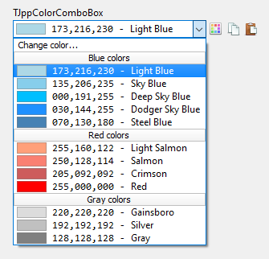

# TJppColorComboBox

* [Current color](#current-color)
* [Color formats](#color-formats)
* [Appearance](#appearance)
* [Separators](#separators)
* [Internal controls](#internal-controls)
* [History](#history)
* [Adding colors](#adding-colors)


A highly customizable *ComboBox* displaying a list of predefined and/or user-defined colors.

<p align="center">

<br><br>

<br><br>

<br><br>

</p>

## Current color

The current color can be read and set using property `SelectedColor`: `TColor`.

## Color formats

Colors can be displayed in three formats: **RGB Int** (eg. 051,102,255), **RGB Hex** (eg. #3366FF), and **BGR Hex** (eg. $00FF6633). If you need to display the color in a different format, you can do this in the `OnGetColorStrValue` event handler.

## Appearance

The appearance of the component can be adjusted using the `Appearance` property. You have a very wide range of options here.

Below is a description of some of the most important:
1. `ShowColorName` - Boolean property. Decides whether to display or hide the color name.
1. `ShowRgbInt`, `ShowRgbHex`, `ShowBgrHex` - Boolean properties. Here you can enable / disable the display of colors in different formats.
1. `ColorRectangle.Width` - Width of the colored rectangles displayed in the list.
1. `NumericFont` - The font used to display color codes. (`UseCustomNumericFont` must be set to `True`).
1. `TextMargin` - The distance from the right edge of the rectangle with the color to the text.
1. `SelectedItem` - Here you can specify the background, font and border colors of the selected item.
1. `SeparatorItem` - Here you can specify the background, font and border colors of the separator item.

## Separators

Separator items are used for separating color groups. Their appearance can be set in the `Appearance.SeparatorItems` property.

To add separator at the end of the list, you can use `AddSeparator` method:
```delphi
JppColorComboBox.AddSeparatorItem('Some caption');
```
You can also add a separator using the `Items` property:
```delphi
JppColorComboBox.Items.Add('-=Some caption'); // the first character must be a dash '-'
```
The `InsertSeparatorItem` method allows you to add a separator anywhere in the list.

## Internal controls

The `TJppColorComboBox` has a built-in label (`BoundLabel`) so there is no need to add a separate label describing the component's function, which is common practice.

In addition, the component has three built-in auxiliary buttons:
1. `ButtonChangeColor` - After clicking it, the system color selection window (`TColorDialog`) is displayed. If the user selects a color and presses OK, it will be stored in the `SelectedColor` property.
1. `ButtonCopyColor` - After the user clicks, the currently selected color is copied to the system clipboard.
1. `ButtonPasteColor` - After clicking, the current color is set to the one from the clipboard (if it is correct).

All of these buttons are inherited from the `TJppBasicSpeedButton` class, so you can freely set PNG icons and background colors, borders, fonts, for all available button states: *normal*, *hot*, *down* and *disabled*.  
Moreover, these buttons have built-in support for the actions. In the `Action` property of each button you can set any action registered in the `TActionList` which is to be executed after clicking the button. But with one caveat, you must do this **at runtime**, eg:
```delphi
JppColorComboBox.ButtonChangeColor.Action := actMyAction; // actMyAction: Vcl.ActnList.TAction
```

The `ButtonSpacing` property specifies the space between these internal buttons.

## History

Each color selected by the user, but not yet in the color list, can be automatically added to the end or top of the list. Thanks to this the user of your application has access to the *history* of previously selected colors.

To enable history, you must check `ccboAddOnSelectIfNotExists` in the `Options` property in the *Object Inspector*, or in the code:
```delphi
ccb.Options := ccb.Options + [ccboAddOnSelectIfNotExists];
```

## Adding colors
You can add colors to the list using the `Items` property or built-in methods: `AddColor`, `InsertColor`, `AddColorsFromArray`.

### Items
Each entry added to the `Items` should have the form:
```
color_name=color_value
```
where `color_value` must be in the form:
1. `R,G,B` - where `R`, `G` and `B` denote the intensity of red, green and blue colors. Eg. `Gold=255,204,000`.
1. `#RGB` - a format commonly used in HTML/CSS. Eg. `Gold=#FFCC00`.
1. `BGR` - a format used internally by Delphi. Eg. `$0000CCFF`.

The color name is optional. You can add color without a name using: `=color_value`.

Example:
```delphi
JppColorComboBox.BeginUpdate;
try
  with JppColorComboBox.Items do
  begin
    Add('Aquamarine=51,204,204');
    Add('Purple=128,0,128');
    Add('Pink=255,0,255');
    Add('Plum=153,51,102');
    Add('Sea=#339966');
    Add('Salmon=$007280FA');
    Add('=50,100,150');
    Add('=100,150,200');
  end;
finally
  JppColorComboBox.EndUpdate;
end;
```
The last two colors have no names.

### *AddColor* and *InsertColor* methods

The `AddColors` method adds a new color to the end of the list. It has two parameters: color name and color value.
Example:
```delphi
JppColorComboBox.AddColor('Red', clRed);
JppColorComboBox.AddColor('Bright Yellow', RGB(252, 249, 225));
JppColorComboBox.AddColor('', RGB(75, 150, 225)); // <-- color wihout name
```
The `InsertColor` method allows you to add a new color anywhere in the list. It has the one additional parameter  - `Index` - which determines the position of the new color item.  
To add color to the top of the list, you can use this code:
```delphi
JppColorComboBox.InsertColor(0, 'Some green color', RGB(208,232,217));
```

If you want to remove all colors from the list and use only your own colors, you can do it, for example, in the following way:

```delphi
  JppColorComboBox.BeginUpdate;
  try
    JppColorComboBox.Clear;

    JppColorComboBox.AddChangeColorItem;

    JppColorComboBox.AddSeparatorItem('Blue colors');
    JppColorComboBox.AddColor('Light Blue', RGB(173,216,230));
    JppColorComboBox.AddColor('Sky Blue', RGB(135,206,235));
    JppColorComboBox.AddColor('Deep Sky Blue', RGB(000,191,255));
    JppColorComboBox.AddColor('Dodger Sky Blue', RGB(030,144,255));
    JppColorComboBox.AddColor('Steel Blue', RGB(070,130,180));

    JppColorComboBox.AddSeparatorItem('Red colors');
    JppColorComboBox.AddColor('Light Salmon', RGB(255,160,122));
    JppColorComboBox.AddColor('Salmon', RGB(250,128,114));
    JppColorComboBox.AddColor('Crimson', RGB(205,092,092));
    JppColorComboBox.AddColor('Red', RGB(255,000,000));

    JppColorComboBox.AddSeparatorItem('Gray colors');
    JppColorComboBox.AddColor('Gainsboro', RGB(220,220,220));
    JppColorComboBox.AddColor('Silver', RGB(192,192,192));
    JppColorComboBox.AddColor('Gray', RGB(128,128,128));

  finally
    JppColorComboBox.EndUpdate;
  end;

  JppColorComboBox.SelectedColor := RGB(173,216,230);
```

Result:

<p align="center">

</p>

### *AddColorsFromArray* method

The method-procedure `AddColorsFromArray` allows you to add colors to the list from array of `TColorArrayItem` records.
This record is defined in the `JPL.ColorArrays` unit (from the [JPLib](https://github.com/jackdp/JPLib) library) as follows:
```delphi
  TColorArrayItem = record
    Color: TColor;
    Name: string;
  end;
```
In this unit you can find 17 arrays with sets of basic colors, system colors, Windows 10 theme colors, and colors recommended for use on websites.

Example: To add a set of 216 web colors to the list, you can use the following code:
```delphi
// uses ..., JPL.ColorArrays;
JppColorComboBox.AddColorsFromArray(Colors_Web_216_Safe, 'Web 216 safe colors', True);
```


