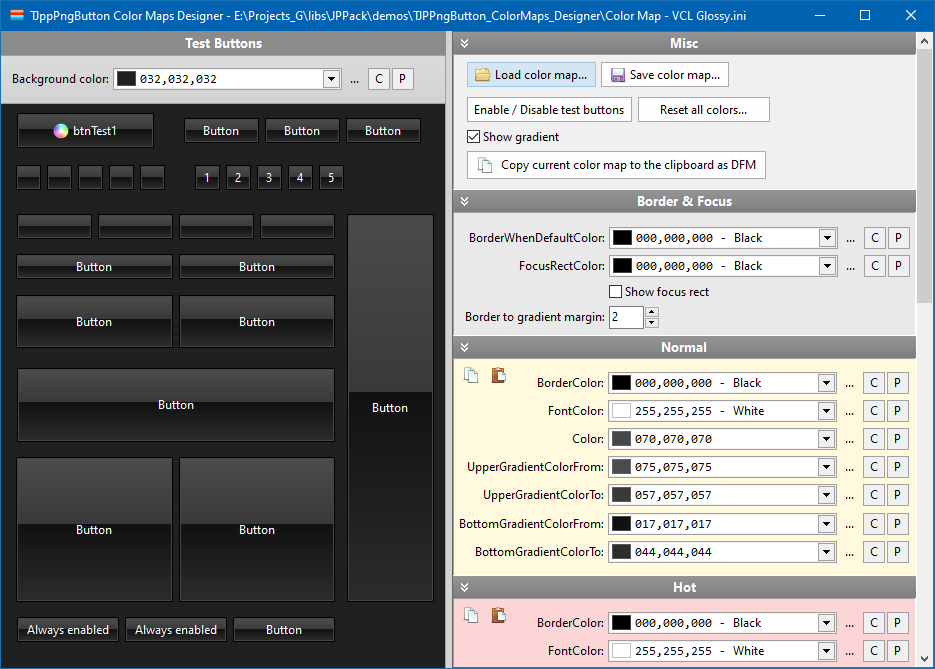

# TJppPngButton

`TJppPngButton` is an extended `TPngBitBtn` button from the **PngComponents** package.  

<p align="center">

</p>

The button can be in one of **five states**: *normal*, *hot*, *down* (pressed), *focused* and *disabled*. For each state you can set a whole range of display parameters: upper and bottom gradient/solid color (similarly to `TJppPanel`), border color, style and width, font parameters (color, name, size, style). You can also turn off drawing border and/or background (`Appearance.<STATE>.TransparentFrame` / `Appearance.<STATE>.TransparentBackground`).

The visibility of the button **caption** can be quickly changed using the `Appearance.ShowCaption` property.  
If you do not want to display the **focus rectangle** on the active button, set property `Appearance.FocusRect` to `frtNone`.  
If you want the button to be displayed in system colors, set property `Appearance.DefaultDrawing` to `True` (all custom colors defined in the `Appearance.<STATES>` will then be ignored).

## TJppPngButton - Color maps (Color schemes)


The number of all colors for all button states is really big, so I decided to make it easier to manage the displayed colors using ready-to-use color schemes (color maps).

I have created 36 different color schemes for `TJppPngButton`. To change the active color scheme, select one of the schemes available in the `ColorMapType` property in the *Object Inspector*. Of course, you can also change the color scheme in the code at runtime.

Over half of the color schemes I have prepared are schemes that mimic the **VCL styles** available from the **XE2** version of the Delphi environment. All such schemes begin with the prefix `cmtVcl`. These *VCL color schemes* work even if you do not enable VCL styles support in your program at all. You can also, for example, turn on the `Charcoal Dark Slate` VCL style for the application, and `cmtVclCarbon` for the `TJppPngButtons`. There is absolutely no problem.

## TJppPngButton Color Maps Designer
All color schemes I have prepared in the `TJppPngButton Color Maps Designer` program, which is located in the repository in the `demos` directory.

<p align="center">

</p>

This program allows you to quickly create new and modify existing color schemes for TJppPngButton. All color changes are visible immediately (on the left side). You can also freely change the background color of the panel with the test buttons in the *Background color* combo box.

You can save the color scheme to an INI file and then load it in your program using `LoadColorMapFromIniFile` method, eg:

```delphi
// You must add JPP.PngButton.ColorMaps unit to uses section.
JppPngButton.LoadColorMapFromIniFile(
  'MyColorScheme.ini', 'JppPngButton_ColorMap', 
  TJppPngButtonIniColorFormat.icfDefault
);
```


`TJppPngButton Color Maps Designer` can also be treated as a demonstration program of one of my other components: `TJppColorComboBox`.
